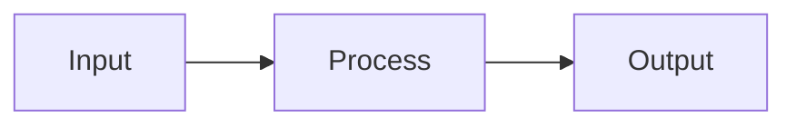

# Planning a Task

**Announce:** "Using wm-plan for task [ID]."

**Core principle:** GATHER CONTEXT → PLAN → VALIDATE → WAIT FOR APPROVAL.

## Inputs

- Task ID, `--new "<work summary>"` for direct task creation, or `--from @page/<spec-path>` for SDD task generation
- Existing task refs, spec refs, template refs, and user constraints

## Preflight

- Read the task or spec first
- Follow every explicit ref before finalizing the plan
- Search for adjacent pages/tasks only after reading the primary source
- Do not write a plan that assumes undocumented architecture decisions
- If the user wants an approved spec or multiple linked tasks executed end to end, route to `/wm-flow @page/<spec-path>` instead of planning one task at a time

## Mode Detection

Check if `$ARGUMENTS` contains `--from`:
- **Yes** → Go to "Generate Tasks from Spec" section
- **No** → Check if `$ARGUMENTS` contains `--new`
  - **Yes** → Go to "Create Task Then Plan" section
  - **No** → Continue with normal planning flow

---

# Create Task Then Plan

Use this mode when the work is too small for a spec or the user has a work summary but no task ID yet.

## Step 0: Classify & Create

Extract the work summary and classify the lane:
- `tiny` for narrow docs/copy/config/low-risk bug fixes
- `normal` for story-sized work with bounded impact
- `high-risk` only when the summary touches auth, data migration, external providers, public contracts, or broad cross-module behavior

If the work is high-risk, stop and recommend `/wm-spec` unless the user explicitly asked to bypass spec creation.

For tiny/normal work:

```json
wm_wm_task_create({
  "title": "<short task title>",
  "description": "<work summary>",
  "priority": "medium",
  "labels": ["<lane>"]
})
```

## Step 0.5: Continue With New Task ID

Use the returned `taskId` as `$ARGUMENTS` and continue with Normal Planning Flow.

---

# Normal Planning Flow

## Step 1: Take Ownership

```json
wm_wm_task_get({ "taskId": "$ARGUMENTS" })
wm_wm_task_update({ "taskId": "$ARGUMENTS", "status": "in-progress", "assignee": "@me" })
wm_wm_time_start({ "taskId": "$ARGUMENTS" })
```

## Step 2: Gather Context

Follow refs in task:

```json
wm_wm_page_get({ "id": "<page-path>", "smart": true })
wm_wm_task_get({ "taskId": "<id>" })
```

If the task links to a spec, resolve related tasks:

```json
wm_wm_search_resolve({ "ref": "@page/<spec-path>{implements}", "direction": "inbound", "entityTypes": "task" })
```

Search related sources:

```json
wm_wm_search_query({ "query": "<keywords>", "type": "page" })
wm_wm_search_query({ "query": "<keywords>", "type": "memory" })
```

Check for available template skills (registered as `wm_skill.<name>`):

When the plan needs assembled execution context:

```json
wm_wm_search_retrieve({ "query": "<keywords>" })
```

## Step 3: Draft Plan

```markdown
## Implementation Plan
1. [Step] (see @page/relevant-doc)
2. [Step] (use template)
3. Add tests
4. Update docs
```

Use mermaid for complex flows:



**Plan quality rules:**
- Steps should be outcome-oriented
- Mention concrete files, pages, or templates when known
- Include testing and validation explicitly
- Keep the plan short enough for approval, but specific enough to execute without re-discovery

## Step 4: Save Plan

```json
wm_wm_task_update({ "taskId": "$ARGUMENTS", "plan": "1. Step one\n2. Step two\n3. Tests" })
```

## Step 5: Validate

**CRITICAL:** After saving plan with refs, validate to catch broken refs:

```json
wm_wm_validate_check({ "entity": "$ARGUMENTS" })
```

If errors found (broken refs), fix before asking approval.

## Step 5.5: Pre-Execution Plan Check

Before presenting the plan for approval, verify plan quality:

### AC Coverage
- Every requirement from the task description should map to at least one plan step
- Every plan step should contribute to at least one AC

### Scope Sizing
- Each plan step should be completable in a single session
- If total plan exceeds ~8 steps → consider splitting into subtasks

### Dependency Check
- Plan steps should be in logical order (foundational first, dependent last)

### Risk Assessment
- Steps involving new external dependencies → flag as higher risk
- Steps touching core/shared modules → flag blast radius

**Report any issues found inline with the plan:**

```
Plan for task-<id>:
1. Step one
2. Step two
⚠️ Plan check: AC-3 not covered by any step
```

## Step 6: Ask Approval

Present plan and **WAIT for explicit approval**.

## Checklist

- [ ] New task created first when using `--new`
- [ ] Ownership taken
- [ ] Timer started
- [ ] Refs followed
- [ ] Templates checked
- [ ] **Validated (no broken refs)**
- [ ] **Pre-execution plan check passed**
- [ ] Routed spec-wide execution to `/wm-flow` when appropriate
- [ ] User approved
- [ ] **Next step suggested**

## Red Flags

- Missing task/spec — stop and report the missing ID/path
- `--new` request is high-risk — recommend `/wm-spec` instead
- User asks to execute an approved spec — recommend `/wm-flow` instead of serial manual planning
- Broken refs — fix or replace them before asking approval
- Scope too large for one task — recommend splitting

## Next Step Suggestion

After approval:

```
/wm-implement <task-id>   — Implement the approved plan
```

If part of `/wm-flow`, return control to the flow orchestrator.

---

# Generate Tasks from Spec

When `$ARGUMENTS` contains `--from @page/<spec-path>`:

## Step 1: Read Spec

```json
wm_wm_page_get({ "id": "<spec-path>", "smart": true })
```

Derive a task prefix from the spec path:
- Path `specs/2026-07-07/user-auth` → prefix `[user-auth-NN]`

## Step 2: Parse Requirements

Scan spec for Functional Requirements (FR-1), Acceptance Criteria (AC-1), and Scenarios.

Group related items into logical tasks. Generate tasks in the task system, not inside the spec body.

## Step 3: Generate Task Preview

For each requirement/group, create task structure:

```markdown
### [user-auth-01] [Requirement Title]
- **ACs:** AC-1, AC-2
- **Spec:** <spec-path>
- **Priority:** medium
- **Order:** 10
```

> **CRITICAL:** The `fulfills` field maps Task → Spec ACs. When the task is done, the matching Spec ACs are auto-checked.

## Step 4: Ask for Approval

> I've generated **X tasks** from the spec. Please review:
> - **Approve** to create all tasks
> - **Edit** to modify before creating
> - **Cancel** to abort

**WAIT for explicit approval.**

## Step 5: Create Tasks

```json
wm_wm_task_create({
  "title": "[<slug>-NN] <requirement title>",
  "description": "<from spec>",
  "spec": "<spec-path>",
  "fulfills": ["AC-1", "AC-2"],
  "priority": "medium",
  "labels": ["from-spec", "spec:<slug>"],
  "order": 10
})
```

Then add implementation ACs:

```json
wm_wm_task_update({
  "taskId": "<new-id>",
  "addAc": ["Implementation step 1", "Implementation step 2", "Tests added"]
})
```

Repeat for each task. Set `order` as `NN * 10` so the board can sort correctly.

## Step 6: Summary

```markdown
Created X tasks linked to `<spec-path>`:
- task-xxx: [user-auth-01] Requirement 1 (3 ACs)
- task-yyy: [user-auth-02] Requirement 2 (2 ACs)
```

## Checklist (--from mode)

- [ ] Spec document read
- [ ] Requirements parsed
- [ ] **Tasks include `fulfills` mapping to Spec ACs**
- [ ] **Task labels and order are set**
- [ ] Tasks previewed and user approved
- [ ] Tasks created with spec link
- [ ] Next action points to `/wm-flow` for spec-wide execution

## Next Step Suggestion (--from mode)

```
/wm-flow @page/<spec-path>   — Execute the task set
/wm-plan <first-task-id>     — Plan individual task manually
```
