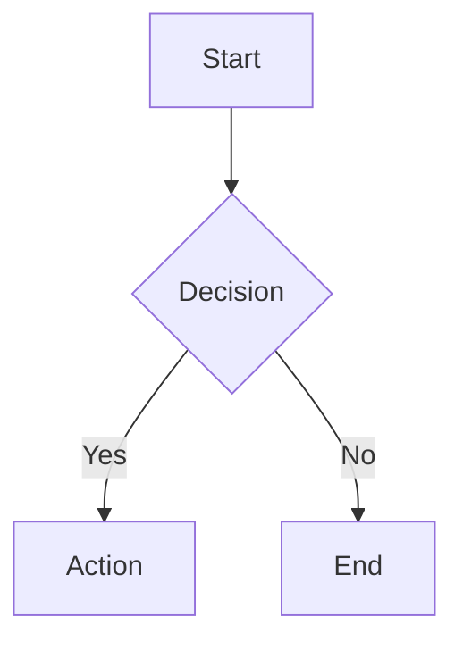

# Working with Docs

**Announce:** "Using wm-doc for [action]."

**Core principle:** SEARCH BEFORE CREATING — avoid duplicates.

## Inputs

- Action: list, get, create, update, or delete
- Page ID, content, folder, tags as needed
- Doc path, topic, folder, or task/spec reference

## Preflight

- Search before creating
- Prefer section edits for targeted changes
- Preserve doc structure and metadata unless the user asked for a restructure
- Validate refs after doc changes

## Quick Reference

```json
// List all docs
wm_doc.list({"action": "list"})

// View flat doc (smart mode — auto-return full content if small, else stats+TOC)
wm_doc.get({"action": "get", "id": "wiki:<path>"})

// View typed page (returns structured frontmatter data)
wm_page.get({"id": "wiki:specs/my-spec"})

// View TOC only
wm_doc.get({"action": "get", "id": "wiki:<path>"})

// View specific section
wm_doc.get({"action": "get", "id": "wiki:<path>"})

// Search docs
wm_search.query({"q": "<query>", "type": "doc"})
```

### Create a Flat Page (wm_doc)

```json
wm_doc({"action": "create", "path": "<folder>/<page-slug>", "title": "<Page Title>",
  "tags": ["<search-keyword>"],
  "content": "..."})
```

**CRITICAL:** Always include `description` — validate will fail without it!

### Create a Typed Page (wm_page)

For structured page types (task, spec, decision, pattern, concept, memory), use `wm_page.create` with the `type` parameter. This enables per-type data fields and graph traversal:

```json
wm_page.create({"action": "create", "path": "decisions/my-decision", "title": "My Decision", "type": "decision", "content": "..."})
```

**Page type reference:**

| PageType | Directory | `type` param | Per-type data |
|---|---|---|---|
| Task | `tasks/` | `"task"` | task_data.acceptance_criteria, estimate |
| Spec | `specs/` | `"spec"` | spec_data.functional_requirements, goals |
| Decision | `decisions/` | `"decision"` | decision_data.context, options, rationale, outcome |
| Pattern | `patterns/` | `"pattern"` | pattern_data.when_to_use, example |
| Concept | `concepts/` | `"concept"` | — (meta only) |
| Memory | `memory/` | `"memory"` | memory_data.layer, ttl_days |
| Howto | `howto/` | `"howto"` | — (meta only) |
| Reference | `reference/` | `"reference"` | — (meta only) |
| Note | `notes/` | `"note"` | — (meta only) |

**Rule of thumb:** Use `wm_page.create` for pages with a clear page type (task, spec, decision, concept). Use `wm_doc.create` for general documentation or when you don't need per-type data fields.

### Update a Page

```json
// Append content (WM has no appendContent — read, modify, then write full):
wm_doc.get({"action": "get", "id": "wiki:<page-id>"})
wm_doc({"action": "update", "id": "wiki:<page-id>", "content": "<existing-content>\n..."})

// Update section only (most efficient)
wm_doc({"action": "update", "id": "wiki:<page-id>", "content": "## 3. New Content\n\n..."})

// Update metadata
wm_doc({"action": "update", "id": "wiki:<page-id>", "title": "New Title", "tags": ["updated", "tag"]})
```

### Link Pages with Edges

Typed pages can be connected via `wm_page.link` to create a traversable graph:

```json
wm_page.link({"id": "wiki:specs/my-spec", "target": "wiki:decisions/my-decision", "edge_type": "answers"})
```

This adds an entry to the source page's `relates_to` frontmatter. Edges enable graph traversal (`wm_graph.neighbors`, `wm_graph.path`) and are used by skills like wm-flow to discover tasks.

**SDD-relevant edge types:**
| Usage | Edge | Direction |
|---|---|---|
| Decision answers spec question | `answers` | Decision → Spec |
| Task implements spec FR | `implements` | Task → Spec |
| Page depends on another page | `depends_on` | Page → Page |
| Concept extends a parent concept | `extends` | Concept → Concept |
| Concept is part of a larger concept | `part_of` | Concept → Concept |
| Page references another page | `references` | Page → Page |
| Page supersedes a previous version | `supersedes` | Page → Page |
| Pattern is an example of a concept | `example_of` | Pattern → Concept |
| Generic relation | `relates_to` | Page ↔ Page |

See @wiki/concepts/edge-types for the full 9-type reference.

### Delete a Page

```json
wm_doc({"action": "delete", "id": "wiki:<page-id>"})
```

## Validate After Changes

**CRITICAL:** After creating/updating docs, validate:

```json
// Validate specific doc (saves tokens)
wm_validate.check({"entity": "<doc-path>"})

// Or validate all docs
wm_validate.check({"scope": "all"})
```

If errors found, fix before continuing.

## Doc Types

| Folder | Purpose | Typed? |
|--------|---------|--------|
| `specs/` | Feature specifications | ✅ spec type |
| `tasks/` | Implementation tasks | ✅ task type |
| `patterns/` | Reusable design patterns | ✅ pattern type |
| `decisions/` | Architecture decision records | ✅ decision type |
| `concepts/` | Domain concepts and glossary | ✅ concept type |
| `howto/` | Guides and tutorials | ✅ howto type |
| `reference/` | API and configuration reference | ✅ reference type |
| `notes/` | Informal notes | ✅ note type |
| `memory/` | Ephemeral recall entries | ✅ memory type |
| `learnings/` | Debugging patterns and discoveries | ⏳ being migrated |

**Note:** For typed folders (specs, tasks, patterns, decisions, concepts), prefer `wm_page.create` with the `type` parameter — this enables per-type data fields and graph edges. Use `wm_doc.create` for general documentation or untyped content.

## Doc Writing Guidelines

- Use descriptive titles that work as search targets
- Cross-reference related pages using `@page/<page-id>` syntax
- Include a brief overview at the top of every page
- Use consistent heading structure (## sections, ### subsections)
- Keep pages focused on one topic — split large pages
- Tag pages appropriately for filtering

## Mermaid Diagrams

WebUI supports mermaid rendering. Use for:
- Architecture diagrams
- Flowcharts
- Sequence diagrams
- Entity relationships

````markdown

````

## Checklist

- [ ] Searched for existing docs before creating
- [ ] Is this a typed page (task, spec, decision, pattern, concept)? → Use `wm_page.create` with `type` param
- [ ] Is this a flat page (howto, reference, note, general)? → Use `wm_doc.create`
- [ ] Created with **description** (required for `wm_doc.create`)
- [ ] Section editing preferred for targeted changes
- [ ] Cross-references use `@page/` syntax
- [ ] Should this page be linked to others via edges? → Use `wm_page.link` after creation
- [ ] Tags applied for discoverability
- [ ] **Validated after changes**
- [ ] Used mermaid for complex flows (optional)

## Red Flags

- Creating pages with duplicate or conflicting IDs
- Writing long-form content without headings or structure
- Forgetting to cross-reference related pages
- Not tagging pages — they won't be discoverable by tag search
- Updating pages without reviewing existing content first
- Creating near-duplicate docs instead of updating an existing one
- Replacing a full doc when only one section needed a change
- Leaving broken refs after an edit

## Final Response Contract

All built-in skills in scope must end with the same user-facing information order: `wm-init`, `wm-spec`, `wm-plan`, `wm-research`, `wm-implement`, `wm-verify`, `wm-doc`, `wm-template`, `wm-extract`, and `wm-commit`.

Required order for the final user-facing response:

1. Goal/result - state what was accomplished.
2. Key details - include the most important supporting context, refs, assumptions, or validation.
3. Next action - recommend a concrete follow-up command only when a natural handoff exists.

Keep this concise for CLI use. Skill-specific content may extend the key-details section, but must not replace or reorder the shared structure.

Out of scope: explaining, syncing, or generating `.claude/skills/*`. Runtime auto-sync already handles platform copies, so this skill source only defines the built-in output contract.

For `wm-doc`, the key details should cover:
- what doc was created/updated, key sections changed, refs checked

## Related Skills

- `/wm-spec` — Create a new spec document
- `/wm-extract` — Extract patterns into docs
- `/wm-commit` — Commit doc changes


## Next Step Suggestion

```
/wm-spec              — Create a new spec document
/wm-extract           — Extract patterns into docs
/wm-commit            — Commit doc changes
```
