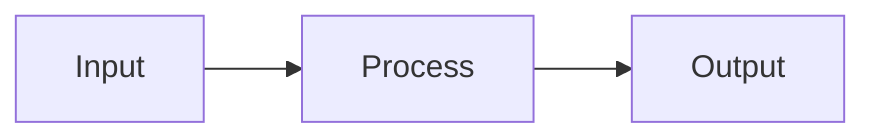

**CRITICAL:** Use `task` subagents for delegation. Do NOT create separate sessions or threads unless the user explicitly asks for one.

# Planning a Task

**Announce:** "Using wm-plan for task [ID]."

**Core principle:** GATHER CONTEXT → PLAN → VALIDATE → WAIT FOR APPROVAL.

## Inputs

- Task ID, `--new "<work summary>"` for direct task creation, or `--from @page/<spec-path>` for SDD task generation
- Existing task refs, spec refs, template refs, and user constraints

## Preflight

- Read the task or spec first
- Follow every explicit ref before finalizing the plan
- Search for adjacent pages/tasks only after reading the primary source
- Do not write a plan that assumes undocumented architecture decisions
- If the user wants an approved spec or multiple linked tasks executed end to end, route to `/wm-flow @page/<spec-path>` instead of planning one task at a time

## Mode Detection

Check if `$ARGUMENTS` contains `--research-only`:
- **Yes** → Go to "Research-Only Mode" section
- **No** → Check if `$ARGUMENTS` contains `--from`:
  - **Yes** → Go to "Generate Tasks from Spec" section
  - **No** → Check if `$ARGUMENTS` contains `--new`
    - **Yes** → Go to "Create Task Then Plan" section
    - **No** → Continue with normal planning flow

---

# Create Task Then Plan

Use this mode when the work is too small for a spec or the user has a work summary but no task ID yet.

## Step 0: Classify & Create

Extract the work summary and classify the lane:
- `tiny` for narrow docs/copy/config/low-risk bug fixes
- `normal` for story-sized work with bounded impact
- `high-risk` only when the summary touches auth, data migration, external providers, public contracts, or broad cross-module behavior

If the work is high-risk, stop and recommend `/wm-spec` unless the user explicitly asked to bypass spec creation.

For tiny/normal work:

```json
wm_task.create({"id": "task-<short-slug>", "title": "<short task title>", "content": "<work summary>",
  "priority": "medium", "tags": ["<lane>"], "acceptance_criteria": ["Criterion 1", "Criterion 2"]})
```

## Step 0.5: Continue With New Task ID

Use the returned `taskId` as `$ARGUMENTS` and continue with Normal Planning Flow.

---

# Normal Planning Flow

## Step 1: Take Ownership

```json
wm_task.get({"id": "$ARGUMENTS"})
wm_task.update({"id": "$ARGUMENTS", "status": "in-progress", "assignee": "@me"})
wm_time.start({"id": "$ARGUMENTS"})
```

## Step 2: Gather Context

Follow refs in task:

```json
wm_doc.get({"action": "get", "id": "wiki:<page-path>"})
wm_task.get({"id": "<id>"})
```

If the task links to a spec, resolve related tasks:

```json
wm_search.resolve({"q": "<spec-path>"})
```

Explore graph connections from found pages:

```json
wm_graph.neighbors({"id": "<page-id>"})
wm_graph.neighbors({"id": "<start-id>", "depth": 1})
wm_graph.subgraph({"id": "<page-id>", "depth": 1})
```

Typed edges: `extends`, `depends_on`, `relates_to`, `implements`.

Search related sources:

```json
wm_search.query({"q": "<keywords>", "type": "doc"})
wm_search.query({"q": "<keywords>", "type": "memory"})
wm_template.list()
```

If relevant memories appear, factor them into the plan (past patterns, decisions, conventions).

When the plan needs assembled execution context:

```json
wm_search.retrieve({"q": "<keywords>", "max_tokens": 4000})
wm_search.retrieve({"q": "<keywords>", "max_tokens": 8000})
```

## Step 3: Draft Plan

```markdown
## Implementation Plan
1. [Step] (see @page/relevant-doc)
2. [Step] (use template)
3. Add tests
4. Update docs
```

Use mermaid for complex flows:



**Plan quality rules:**
- Steps should be outcome-oriented, not a dump of implementation details
- Mention concrete files, pages, or templates when known
- Include testing and validation explicitly
- Keep the plan short enough for approval, but specific enough to execute without re-discovery
- If supporting knowledge is too large, move it into a doc and reference it rather than bloating the plan

## Step 4: Save Plan

```json
wm_task.update({"id": "$ARGUMENTS"})
```

## Step 5: Validate

**CRITICAL:** After saving plan with refs, validate to catch broken refs:

```json
wm_validate.check({"entity": "$ARGUMENTS"})
```

If errors found (broken refs), fix before asking approval.

## Step 5.5: Pre-Execution Plan Check

Before presenting the plan for approval, verify plan quality:

### AC Coverage
- Every requirement from the task description should map to at least one plan step
- Every plan step should contribute to at least one AC
- Flag any AC that no plan step addresses

### Scope Sizing
- Each plan step should be completable in a single session
- If a step requires reading >10 files or touching >5 files → recommend splitting
- If total plan exceeds ~8 steps → consider splitting into subtasks

### Dependency Check
- Plan steps should be in logical order (foundational first, dependent last)
- Flag circular dependencies between steps
- Flag steps that assume undocumented context

### Risk Assessment
- Steps involving new external dependencies → flag as higher risk
- Steps touching core/shared modules → flag blast radius
- Steps with no test coverage in plan → flag

**Report any issues found inline with the plan:**

```
Plan for task-<id>:
1. Step one
2. Step two
⚠️ Plan check: AC-3 not covered by any step
⚠️ Plan check: Step 4 touches 7 files — consider splitting
```

Fix issues before presenting for approval. If unfixable, surface them explicitly so the user can decide.

## Step 6: Ask Approval

Present plan and **WAIT for explicit approval**.

## Checklist

- [ ] New task created first when using `--new`
- [ ] Ownership taken
- [ ] Timer started
- [ ] Refs followed
- [ ] Templates checked
- [ ] Memories factored into plan
- [ ] **Validated (no broken refs)**
- [ ] **Pre-execution plan check passed (AC coverage, scope sizing, dependencies, risk)**
- [ ] Routed spec-wide execution to `/wm-flow` when appropriate
- [ ] User approved
- [ ] **Next step suggested**

## Red Flags

- Missing task/spec — stop and report the missing ID/path
- `--new` request is high-risk — recommend `/wm-spec` instead
- User asks to execute an approved spec — recommend `/wm-flow` instead of serial manual planning
- Broken refs — fix or replace them before asking approval
- Scope too large for one task — recommend splitting
- Ignoring memories from past work — may repeat past mistakes


## Final Response Contract

All built-in skills in scope must end with the same user-facing information order: `wm-init`, `wm-spec`, `wm-plan`, `wm-research`, `wm-implement`, `wm-verify`, `wm-doc`, `wm-template`, `wm-extract`, and `wm-commit`.

Required order for the final user-facing response:

1. Goal/result - state what was accomplished.
2. Key details - include the most important supporting context, refs, assumptions, or validation.
3. Next action - recommend a concrete follow-up command only when a natural handoff exists.

Keep this concise for CLI use. Skill-specific content may extend the key-details section, but must not replace or reorder the shared structure.

Out of scope: explaining, syncing, or generating `.claude/skills/*`. Runtime auto-sync already handles platform copies, so this skill source only defines the built-in output contract.

For `wm-plan`, the key details should cover:
- the concise implementation plan
- key assumptions or unresolved questions
- references used to derive the plan
- an explicit approval gate or validation result

## Related Skills

- `/wm-research` — Research before planning
- `/wm-implement <id>` — Implement after plan approved
- `/wm-spec` — Create spec for complex features

## Next Step Suggestion

After approval:

```
/wm-implement <task-id>   — Implement the approved plan
```

If part of `/wm-flow`, return control to the flow orchestrator.

---

# Research-Only Mode

Use this mode to gather context, synthesize findings, and output a structured research report without creating any plan.

## Search Order

1. Project docs and memories (unified search)
2. Expand context via structural relations (if spec/doc found)
3. Completed or related tasks (keyword search for gaps)
4. Existing code paths and implementations
5. Adjacent tests, templates, and validation logic

## Step 1: Gather Context

Follow refs in task:

```json
wm_doc.get({"action": "get", "id": "wiki:<page-path>"})
wm_task.get({"id": "<id>"})
```

Search documentation and memory:

```json
wm_search.query({"q": "<topic>", "type": "doc"})
wm_search.query({"q": "<topic>", "type": "memory"})
wm_search.retrieve({"q": "<topic>", "max_tokens": 4000})
```

If the task links to a spec, resolve related tasks:

```json
wm_search.resolve({"q": "<spec-path>"})
```

Explore graph connections:

```json
wm_graph.neighbors({"id": "<page-id>"})
wm_graph.neighbors({"id": "<start-id>", "depth": 1})
wm_graph.neighbors({"id": "<page-id>", "depth": 2})
wm_graph.subgraph({"id": "<page-id>", "depth": 1})
```

Typed edges: `extends`, `depends_on`, `relates_to`, `implements`.

If relevant memories appear, include them in findings and note whether they're still current.

## Step 2: Synthesize Findings

```markdown
## Research: [Topic]

### Existing Implementations
- `src/path/file.ts`: Does X

### Patterns Found
- Pattern 1: Used for...

### Related Docs
- @doc/path1 - Covers X

### Recommendations
1. Reuse X from Y
2. Follow pattern Z
```

Present findings with page references, key insights, and actionable next steps.

## Knowledge Spillover Rule

If the research surface becomes too large for one response or one task:

- Create or update a wiki page for the reusable/domain knowledge
- Reference that doc from the current task or plan with `@doc/<path>`
- Keep the research summary short and point to the canonical doc instead of repeating everything inline

If the research uncovers a broad follow-up topic that should be tracked independently:

- Create a task for that general knowledge or follow-up work
- Reference it with `@task-<id>` from the current context
- Do not silently expand the original task with unrelated background work

## Fallbacks

- If search is noisy, narrow by file type, feature folder, or known reference IDs
- If no existing pattern is found, state that explicitly rather than implying one exists
- If docs and code disagree, call out the mismatch

## Checklist

- [ ] Searched documentation and memory first
- [ ] Expanded context via structural resolve (if spec/doc found)
- [ ] Reviewed similar completed tasks
- [ ] Explored graph connections
- [ ] Found existing code patterns
- [ ] Identified reusable components
- [ ] Findings synthesized with page references
- [ ] Knowledge spillover applied if surface too large

## Red Flags

- Diving into code search before checking docs — docs first, code second
- Ignoring graph connections — neighboring pages often contain critical context
- Not using `retrieve` when implementation needs organized context packs
- No response when no pattern exists — state explicitly

## Next Step Suggestion

```
/wm-plan <task-id>    — Plan implementation with researched context
/wm-spec              — Create a spec based on findings
```

---

# Generate Tasks from Spec

When `$ARGUMENTS` contains `--from @page/<spec-path>`:

## Step 1: Read Spec

```json
wm_doc.get({"action": "get", "id": "wiki:<spec-path>"})
```

Derive a task prefix from the spec path:
- Path `specs/2026-07-07/user-auth` → prefix `[user-auth-NN]`

## Step 2: Parse Requirements

Scan spec for Functional Requirements (FR-1), Acceptance Criteria (AC-1), and Scenarios.

Group related items into logical tasks. Generate tasks in the task system, not inside the spec body.

## Step 3: Generate Task Preview

For each requirement/group, create task structure:

```markdown
### [user-auth-01] [Requirement Title]
- **ACs:** AC-1, AC-2
- **Spec:** <spec-path>
- **Priority:** medium
- **Order:** 10
```

> **CRITICAL:** The `fulfills` field maps Task → Spec ACs. When the task is done, the matching Spec ACs are auto-checked.

## Step 4: Ask for Approval

> I've generated **X tasks** from the spec. Please review:
> - **Approve** to create all tasks
> - **Edit** to modify before creating
> - **Cancel** to abort

**WAIT for explicit approval.**

## Step 5: Create Tasks

```json
wm_task.create({"id": "<slug>-nn", "title": "[<slug>-NN] <requirement title>", "content": "<from spec>",
  "priority": "medium", "tags": ["from-spec", "spec:<slug>"], "acceptance_criteria": ["<from spec ACs>"]})
```

Then add implementation ACs:

```json
wm_task.update({"id": "<new-id>"})
```

Repeat for each task. Set `order` as `NN * 10` so the board can sort correctly.

## Step 6: Summary

```markdown
Created X tasks linked to `<spec-path>`:
- task-xxx: [user-auth-01] Requirement 1 (3 ACs)
- task-yyy: [user-auth-02] Requirement 2 (2 ACs)
```

## Checklist (--from mode)

- [ ] Spec document read
- [ ] Requirements parsed
- [ ] **Tasks include `fulfills` mapping to Spec ACs**
- [ ] **Task labels and order are set**
- [ ] Tasks previewed and user approved
- [ ] Tasks created with spec link
- [ ] Next action points to `/wm-flow` for spec-wide execution

## Next Step Suggestion (--from mode)

```
/wm-flow @page/<spec-path>   — Execute the task set
/wm-plan <first-task-id>     — Plan individual task manually
```
