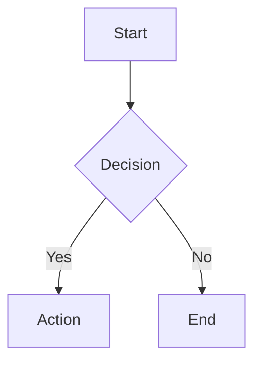

# Working with Docs

**Announce:** "Using wm-doc for [action]."

**Core principle:** SEARCH BEFORE CREATING — avoid duplicates.

## Inputs

- Action: list, get, create, update, or delete
- Page ID, content, folder, tags as needed
- Doc path, topic, folder, or task/spec reference

## Preflight

- Search before creating
- Prefer section edits for targeted changes
- Preserve doc structure and metadata unless the user asked for a restructure
- Validate refs after doc changes

## Quick Reference

```json
// List all docs
wm_doc.list()

// View doc (smart mode — auto-return full content if small, else stats+TOC)
wm_doc.get({"path": "<path>"})

// View TOC only
wm_doc.get({"path": "<path>"})

// View specific section
wm_doc.get({"path": "<path>"})

// Search docs
wm_search.query({"q": "<query>", "type": "doc"})
```

### Create a Page

```json
wm_doc.create({"path": "<folder>/<page-slug>", "title": "<Page Title>",
  "tags": ["<search-keyword>"],
  "content": "..."})
```

**CRITICAL:** Always include `description` — validate will fail without it!

### Update a Page

```json
// Append content (WM has no appendContent — read, modify, then write full):
wm_doc.get({"path": "<page-id>"})
wm_doc.update({"path": "<page-id>", "content": "<existing-content>\n..."})

// Update section only (most efficient)
wm_doc.update({"path": "<page-id>", "content": "## 3. New Content\n\n..."})

// Update metadata
wm_doc.update({"path": "<page-id>", "title": "New Title", "tags": ["updated", "tag"]})
```

### Delete a Page

```json
wm_doc.delete({"path": "<page-id>"})
```

## Validate After Changes

**CRITICAL:** After creating/updating docs, validate:

```json
// Validate specific doc (saves tokens)
knowns_validate({"entity": "<doc-path>"})

// Or validate all docs
knowns_validate({"scope": "docs"})
```

If errors found, fix before continuing.

## Doc Types

| Folder | Purpose |
|--------|---------|
| `specs/` | Feature specifications |
| `patterns/` | Reusable design patterns |
| `decisions/` | Architecture decision records |
| `howto/` | Guides and tutorials |
| `reference/` | API and configuration reference |
| `concepts/` | Domain concepts and glossary |
| `learnings/` | Debugging patterns and discoveries |

## Doc Writing Guidelines

- Use descriptive titles that work as search targets
- Cross-reference related pages using `@page/<page-id>` syntax
- Include a brief overview at the top of every page
- Use consistent heading structure (## sections, ### subsections)
- Keep pages focused on one topic — split large pages
- Tag pages appropriately for filtering

## Mermaid Diagrams

WebUI supports mermaid rendering. Use for:
- Architecture diagrams
- Flowcharts
- Sequence diagrams
- Entity relationships

````markdown

````

## Checklist

- [ ] Searched for existing docs before creating
- [ ] Created with **description** (required!)
- [ ] Section editing preferred for targeted changes
- [ ] Cross-references use `@page/` syntax
- [ ] Tags applied for discoverability
- [ ] **Validated after changes**
- [ ] Used mermaid for complex flows (optional)

## Red Flags

- Creating pages with duplicate or conflicting IDs
- Writing long-form content without headings or structure
- Forgetting to cross-reference related pages
- Not tagging pages — they won't be discoverable by tag search
- Updating pages without reviewing existing content first
- Creating near-duplicate docs instead of updating an existing one
- Replacing a full doc when only one section needed a change
- Leaving broken refs after an edit

## Next Step Suggestion

```
/wm-spec              — Create a new spec document
/wm-extract           — Extract patterns into docs
/wm-commit            — Commit doc changes
```
